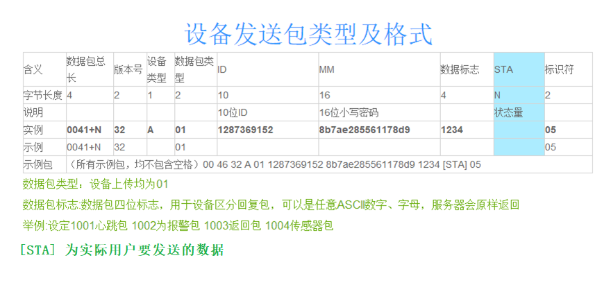
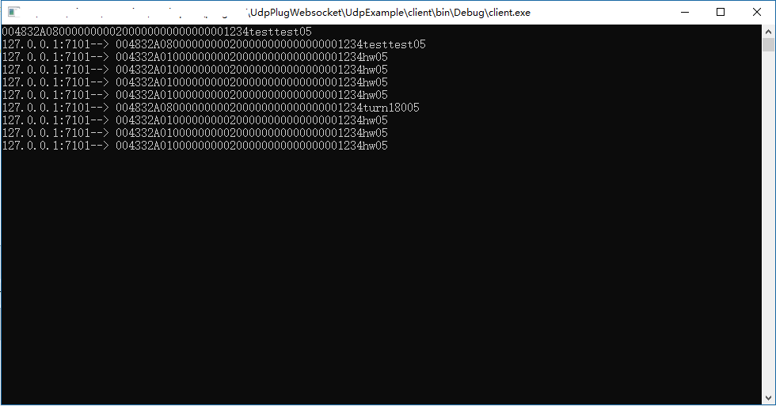
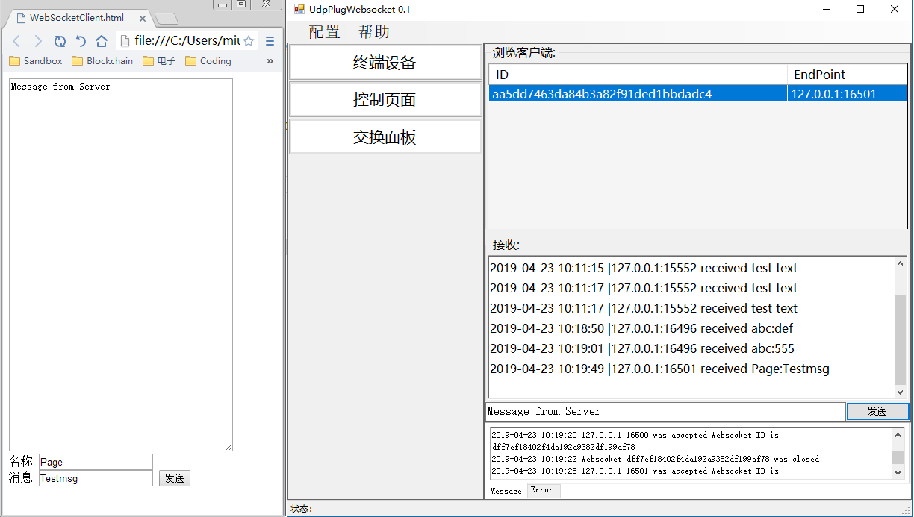

## 项目说明  ##

公司要做物联网硬件产品，需要一个服务器组件桥接APP软件终端和物联网硬件。 目前比较火的MQTT物联网协议虽然技术先进，但进入门槛较高，用户也相对较为复杂。BG了一番没有找到合适的服务端开源代码，就决定使用自己比较熟悉的.Net技术从头开发一个服务器组件。于是开了这个repository，如果能帮到你，我很高兴。 有问题欢迎与我微信联系： 微信号miuser00，加好友请注明您的来意。

## 项目简介 ##
这是一个独立的可执行Win32服务端程序，用于桥接终端APP和物联网硬件。 APP端为Websocet接口的静态html页面，硬件端为基于Arduino开发的电路，与服务器通讯使用UDP协议通讯（注：为方便您的使用，本Respository亦提供了一个C#编写的简易UDP测试程序用来模拟硬件设备）。 APP通过Webscoket接口发送一个自定义的字符串报文给服务端，服务端根据报文中的ID把报文转发给相同ID的UDP硬件设备（或UDP测试程序）。

启动方法：在本地windows环境下运行.\UdpPlugWebsocket\bin\Debug\UdpPlugWebsocket.exe即可按照config.xml中描述的端口启动服务程序。默认UDP端口为7101，Websocket端口为9000。此时外部的UDP连接和Websocket连接都会在UI中显示。其中UDP在终端设备页面中显示，Websocket连接在控制页面中显示，通讯状况在交换面板页面中显示。您可以通过配置->显示调试系信息 打开或关闭UI的通讯Log。

## 数据包格式 （UDP与Websocket相同）##

**Endpoint是外部连接的唯一索引。**

**Endpoint字符串的格式为："XXX.XXX.XXX.XXX:XXXX" 前四组三位数为IP地址，最后一组四位数为远程端口号**

##UDP通讯测试##

	运行.\UdpExample\client\bin\Debug\client.exe 在程序控制台中输入如下数据包
	004832A08000000000200000000000000001234testtest05 即可在终端设备页面看到本机的连接。

## Websocket通讯测试 ##
	任意支持websocket的浏览器中运行.\UPW_Browser\index.html?ID=0000000002&MM=0000000000000000与UDP测试程序建立连接（参数区分大小写）

## 目录结构 ##
	.\UdpPlugWebsocket 						UPWS服务程序（主服务程序）	
	.\UdpPlugWebsocket\UdpExample 			UDP测试程序 	
	.\UPW_Browser							Websocket测试程序
	.\bin_UPWS								编译后的Win32项目二进制文
	...										其余目录为参考代码目录，可删除	

##编译环境##
Visual Studio 2015,C#,Win10
	
## 使用到的开源库 ##
	Websocket-Sharp
	https://github.com/sta/websocket-sharp
	Coldairarrow.Util.Sockets	
	https://github.com/Coldairarrow/Sockets

## 关键词  ##

C#,Websocket,UDP,物联网,异步编程,接口,lamda表达式,线程池,Action,Invoke,Arduino,ESP8266

## 版权声明 ##

如果您愿意使用 UdpPlugWebSocket 组件，请遵循 MIT 许可所述内容.